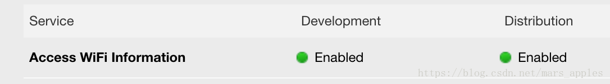

#  iOS 硬件信息


|信息类型|类型说明|能否获取|示例|备注|
|:---:|:---:|:---:|:---:|:---:|
|手机型号|具体那一款手机|支持|iPhone，iPad，iPod|通过systemInfo.machine获取|
|系统版本|手机系统的版本|支持|iPhone9,1，iPhone9,2|通过systemInfo.machine获取|
|屏幕分辨率|手机屏幕分辨率|支持|568×320，667×375|包括物理分辨率和逻辑分辨率|
|IMEI|手机设备唯一标识|~~不支持~~|493002407599521|iOS 5之后被禁止获取|
|IMSI|sim卡用户身份识别码|~~不支持~~|460030912121001|只能获取部分代号|
|SIM卡序列号|sim卡的唯一标识|~~不支持~~|手机卡背面4行共20个数字|无法获取|
|手机号码|一般为11位数字|~~不支持~~|18888888888|iOS 5之后被禁止获取，获取值都为nil|
|运营商信息|提供网络服务的供应商|支持|中国移动，中国联通，中国电信|有多种方法获取|
|运行内存|手机内存RAM|不准确|647.5MB|API获取的不准确|
|CPU型号|CPU类型|支持|CPU_TYPE_X86_64，核心数为2|CPU类型和核心数|
|手机主板型号|手机主板硬件的编号|~~不支持~~|无法获取|无法获取|
|是否破解|手机是否越狱|不准确|通过判断是否存在某些文件|新越狱工具可能检测不到|
|mac地址|网卡的物理地址|~~不支持~~|02:00:00:00:00:00|iOS 7之后被禁止获取|
|当前网络环境|当前手机使用WiFi/4G|支持|2G/3G/4G/WIFI|状态栏获取或其他方法获取|
|IP|手机连入网络的地址|不准确|111.200.9.21|使用代理情况下IP是不准确的|
|GPS|卫星定位|不准确|获取经纬度反地理编码|地下室等GPS信号弱有较大误差|
|设备序列号|设备唯一标识|不准确|iOS的UUID|删除重装会变，重置位置和隐私会变|
|APP安装时间及更新时间|安装时间及更新时间|支持|2017/8/1 下午2:08:00|可用沙盒文件创建时间|


部分详细说明

手机型号：通过systemInfo.machine获取判断是哪种设备。
系统版本：通过systemInfo.machine获取设备型号后判断，例如iPhone9,1对应iPhone7，iPhone9,2对应iPhone7 Plus。
屏幕分辨率：包括物理分辨率和逻辑分辨率，物理分辨率=逻辑分辨率×屏幕缩放比(就是的1x，2x，3x)，1x设备现在基本绝迹，2x对应4寸和4.7屏幕，3x对应Plus设备的5.5寸屏幕。
IMEI：IMEI(International Mobile Equipment Identity)是国际移动设备身份码的缩写，国际移动装备辨识码，是由15位数字组成的"电子串号"，它与每台移动电话机一一对应，而且该码是全世界唯一的。电话拨号键盘输入*#06#即可显示。
IMSI：sim卡中用户身份识别码，储存在SIM卡中。iOS设备现在只能通过CTTelephonyNetworkInfo获取部分信息，如中国MCC代号460，MNC中国移动为00，02，07，IMSI是由信息拼接而成，具体拼接方法Google
SIM卡序列号：sim卡的唯一标识，就是sim卡背面的四行数字，共20个数字。
运营商信息：有多种方法获取，通过CTTelephonyNetworkInfo框架获取，或者通过遍历状态栏StatusBar图标文字获取；其中如果未安装sim卡时，国行iPhone通过CTTelephonyNetworkInfo获取为默认值中国移动。
运行内存：手机运行程序时的内存RAM(不是存储空间),可通过手机型号反推，通过API获取的不准确。
CPU型号：能够获取CPU类型(例如32位CPU和64位CPU)和核心数(双核单核)。
mac地址：iOS 7之后被禁止获取，所有手机获取到的都是02:00:00:00:00:00。
APP安装时间及更新时间：可用沙盒文件(例如info.plist)创建时间来计算实际安装时间，也就是更新时间。至于App首次安装时间，可在沙盒存储一个时间标记，有值读取即可，无值时存入本次的安装时间。


### 获取连接的Wi-Fi名称

获取WiFi的SSID的方法如下：
OC
```
#import <SystemConfiguration/CaptiveNetwork.h>

+ (NSString *)wifiSSID {
NSString *ssid = nil;
NSArray *ifs = (__bridge_transfer id)CNCopySupportedInterfaces();
for (NSString *ifnam in ifs) {
NSDictionary *info = (__bridge_transfer id)CNCopyCurrentNetworkInfo((__bridge CFStringRef)ifnam);
if (info[@"SSID"]) {
ssid = info[@"SSID"];
}
}    return ssid;
}
```
```
- (NSString *)getWifiNamed {

NSArray *ifs = ( NSArray *)CNCopySupportedInterfaces();

if (!ifs) {

return nil;

}

NSString *WiFiName = nil;

for (NSString *ifnam in ifs) {

NSDictionary *info = ( NSDictionary *)CNCopyCurrentNetworkInfo((__bridge CFStringRef)ifnam);

if (info && [info count]) {

// 这里其实对应的有三个key:kCNNetworkInfoKeySSID、kCNNetworkInfoKeyBSSID、kCNNetworkInfoKeySSIDData，

// 不过它们都是CFStringRef类型的

WiFiName = [info objectForKey:(__bridge NSString *)kCNNetworkInfoKeySSID];

//            WiFiName = [info objectForKey:@"SSID"];

break;

}

}

return WiFiName;

}
```
Swift
```
private func fetchNetInfo() -> [String : AnyObject]{

let interfaceNames = CNCopySupportedInterfaces()
var SSIDInfo = [String : AnyObject]()
guard interfaceNames != nil else {
return SSIDInfo
}
for interface in interfaceNames as! [CFString] {
print("Looking up SSID info for \(interface)") // en0
if let info = CNCopyCurrentNetworkInfo(interface as CFString){
SSIDInfo = info as! [String : AnyObject]
}
for d in SSIDInfo.keys {
print("\(d): \(SSIDInfo[d]!)")
}
if SSIDInfo.count > 0{
break
}
}
return SSIDInfo

}
```

iOS12中无法获取到Wi-Fi的SSID，通过查看官方文档，发现文档中增加了Important字样的描述：

>
Important
To use this function in iOS 12 and later, enable the Access WiFi Information capability for your app in Xcode. When you enable this capability, Xcode automatically adds the Access WiFi Information entitlement to your entitlements file and App ID.
重要描述
在iOS 12+中使用此方法需要在Xcode中为应用授权获取WiFi信息的能力。授权后，Xcode会自动在App ID和应用的权限列表中增加获取WiFi信息的权限。

* 解决方案：Xcode -> [Project Name] -> Targets -> [Target Name] -> Capabilities -> Access WiFi Information -> ON

1、appid中勾选Access WiFi Infomation


2、xCode中Capabilities中，激活Access WiFi Infomation项。


### 参考
[iOS获取硬件信息(全部)](https://www.jianshu.com/p/6d85416fb494)

[ios开发常用硬件信息获取方法汇总](https://www.cnblogs.com/fantasy940155655/p/5708317.html)

