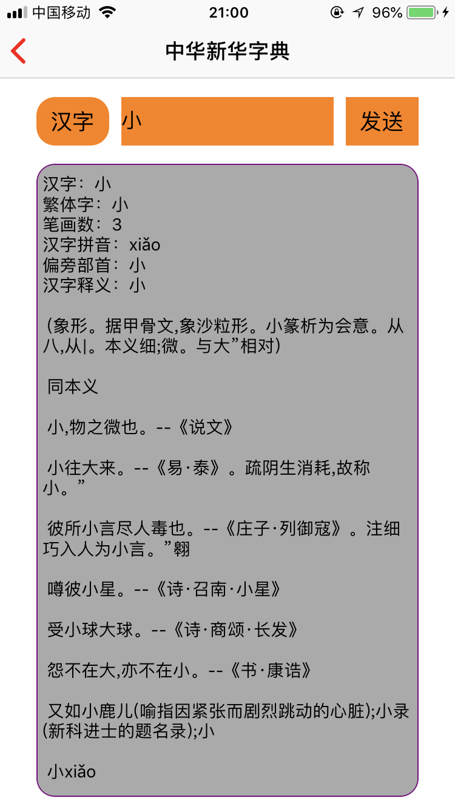

# MyInsight_iOS
## iOS DEMO合集
###OC Demo名字**有鹿(A-Deer)**

首先感谢NJHu大神提供的[iOSProject](https://github.com/NJHu/iOSProject)这个demo模版。我在原demo的基础上套用了自己的工程结构，并添加了一些其他的功能如:蓝牙、地图等。

关于iOS知识和功能的DEMO合集，代码语言OC，关于Swift版本的Demo合集尚未整理。

[OC Demo工程](./MyInsight/README.md)

[Swift Demo工程](./MyInsight_Swift/README.md)

基础：

生命周期、RunTime、协议

## 基础

 

|

 

 
 

进阶：

抽屉、横竖屏切换、蓝牙、地图、网络请求、数据解析

高级：

OpenCV、ffmpeg、音频、Socket

其他：

百思不得姐、糗事百科

 

<h3>新华字典</h3>

[小程序教程](https://www.zhihu.com/question/50907897)

微信第三方登录及其他功能 由于需要企业码 暂时先不实现。

常用第三方demo链接汇总：
[蓝牙]()

[弹幕渲染库](https://github.com/unash/BarrageRenderer)   

